Geog6300: Final Project: Modelling Water Surface Salinity from Remote
Sensing based Reflectance Data
================

Your name: Chintan B. Maniyar

## Research question:

-   Water Surface Salinity (WSS) is a measure of the amount of dissolved
    oxygen in the water and has no evident color signal. This project
    aims to answer the following two questions:  

1.  Is it possible to estimate water surface salinity by remote sensing
    methods using satellite data, specifically along the coast of
    Georgia? If yes, what wavelength is sensitive to WSS variation?

2.  Moreover, since WSS depends highly on the turbidity and suspended
    particles in the water, can remote sensing based indices/quantities
    such as Color Dissolved Organic Matter (CDOM), Normalized Difference
    Chlorophyll Index (NDCI) and Normalized Suspended Material Index
    (NSMI) be used as proxy to estimate WSS from satellite data?

## Data

-   The dataset for this assignment is a combination of in-situ and
    coincident satellite data. In-situ WSS and water surfce temperature
    values were recorded for the Georgian coast by field sampling as
    well as Research Vehicle Savannah. Co-incident Sentinel-2 images
    captured within a 30 minute window of in-situ sampling were acquired
    for 2018-2020 period. Pixel values for all 13 bands were extracted
    from these images based on the ground sampling locations. Hence,
    this dataset looks something like this: for each sampling point:
    Surface Reflectance (SR) values from Sentinel-2 and corresponding
    WSS value recorded on ground.

-   From the raw bands, the aforementioned indices (CDOM, NDCI, NSMI)
    are also calculated

-   Additional band ratios are calculated based on literature survey

-   Source of Ground Data: Georgia Coastal Ecosystems (GCE-LTER)

-   Satellite data was curated by downloading coincident freely
    available Sentinel-2 Imagery

-   Following chunk shows the sample of the dataset:

``` r
pander(head(salinity_data))
```

| ï..B1 | B2  | B3  | B4  | B5  |  B6  |  B7  |  B8  | B8A  |  B9  | B11  | B12  |
|:-----:|:---:|:---:|:---:|:---:|:----:|:----:|:----:|:----:|:----:|:----:|:----:|
|  156  | 191 | 327 | 339 | 523 | 959  | 1083 | 1284 | 1294 | 1183 | 1085 | 647  |
|  262  | 261 | 357 | 339 | 461 | 627  | 672  | 812  | 816  | 828  | 713  | 444  |
|  369  | 472 | 601 | 597 | 864 | 1212 | 1319 | 1492 | 1472 | 1487 | 1485 | 1035 |
|  396  | 464 | 620 | 581 | 924 | 1494 | 1700 | 1828 | 1778 | 1734 | 1472 | 941  |
|  389  | 322 | 432 | 407 | 674 | 1185 | 1359 | 1389 | 1449 | 1738 | 1038 | 602  |
|  331  | 305 | 500 | 483 | 763 | 1111 | 1203 | 1243 | 1293 | 1610 | 1040 | 612  |

Table continues below

|  NDVI  | CDOM.Proxy..B3.B4. |  NDCI  |  NSMI  | B4.B3  | B4.B2 | B4.B1 |
|:------:|:------------------:|:------:|:------:|:------:|:-----:|:-----:|
| 0.5823 |       0.9646       | 0.2135 | 0.5543 | 1.037  | 1.775 | 2.173 |
| 0.4109 |       1.053        | 0.1525 | 0.4545 | 0.9496 | 1.299 | 1.294 |
| 0.4284 |       1.007        | 0.1828 | 0.4347 | 0.9933 | 1.265 | 1.618 |
| 0.5176 |       1.067        | 0.2279 | 0.4426 | 0.9371 | 1.252 | 1.467 |
| 0.5468 |       1.061        | 0.247  | 0.4453 | 0.9421 | 1.264 | 1.046 |
| 0.4403 |       1.035        | 0.2247 | 0.5264 | 0.966  | 1.584 | 1.459 |

Table continues below

| GCE_Salinity | GCE_Temperature.C. |
|:------------:|:------------------:|
|     2.62     |       14.33        |
|    19.26     |       15.89        |
|    20.58     |       17.24        |
|    18.31     |       24.85        |
|     1.24     |       25.93        |
|    20.87     |       30.48        |

## Methods

-   As discussed thus far, the main goal of this project is to
    investigate if it is possible to estimate WSS entirely using
    satellite data. This essentially means investigating the
    relationship and underlying pattern (if any) between the satellite
    recorded SR values and the ground sampled WSS values.

-   To answer question 1, I propose to use a correlation matrix with the
    variables: Bands 1 through 12, all indices and band ratios and
    ground sampled WSS values. I choose correlation since all variables
    are continuous. Based on whether the data is parametric or
    non-parametric, I would choose pearson or spearman correlation
    respectively. This would:

    1.  Show any underlying correlation between any of the bands and
        salinity values, hence answering the question if a particluar
        wavelength in the optical spectrum is sensitive to WSS
        variation.
    2.  Also show underlying correlation between WSS and all indices and
        band ratios, enabling me to understand better if the literature
        reviews are relavant for my study site as well

-   To answer question 2, I propose to build a multi-variate linear
    regression (MLR) model with bands 1 through 12, band ratios and
    indices as independent variables (initially) and WSS as the
    dependent variable. The set of independent variables will be
    consequently modified by checking for multicollinearity (VIF test)
    and homoscedastity (bptest), in order to ensure that each
    independent variable is carrying unique information to the model.
    Finally an MLR model with a refined set of independent variables
    will be suggested and inferred, leading to a discussion of how far
    along can one get in estimating WSS values using satellite data.

## Analysis

This section is structured into 3 subsections. While after every code
chunk there will be inferential statements, the end of each subsection
will summarize the purpose and overall inference of that subsection.

### 0. Data Pre-Analysis

Before we actively start to probe our research questions, let us
understand the nature of our dependent and independent variables –
whether or not they are normal. We would plot qq-plots for all of them
to test their normality. If the qq-plot aligns in a straight line, it
means that variable is distributed normally. If the qq-plot resembles a
smile or a frown, it means the the variable is positively skewed or
negatively skewed respectively.

``` r
b1 <- ggplot(salinity_data, aes(sample=ï..B1)) + stat_qq() + stat_qq_line() + ggtitle("Band-1")
b2 <- ggplot(salinity_data, aes(sample=B2)) + stat_qq() + stat_qq_line() + ggtitle("Band-2")
b3 <- ggplot(salinity_data, aes(sample=B3)) + stat_qq() + stat_qq_line() + ggtitle("Band-3")
b4 <- ggplot(salinity_data, aes(sample=B4)) + stat_qq() + stat_qq_line() + ggtitle("Band-4")
b5 <- ggplot(salinity_data, aes(sample=B5)) + stat_qq() + stat_qq_line() + ggtitle("Band-5")
b6 <- ggplot(salinity_data, aes(sample=B6)) + stat_qq() + stat_qq_line() + ggtitle("Band-6")
b7 <- ggplot(salinity_data, aes(sample=B7)) + stat_qq() + stat_qq_line() + ggtitle("Band-7")
b8 <- ggplot(salinity_data, aes(sample=B8)) + stat_qq() + stat_qq_line() + ggtitle("Band-8")
b8a <- ggplot(salinity_data, aes(sample=B8A)) + stat_qq() + stat_qq_line() + ggtitle("Band-8A")
b9 <- ggplot(salinity_data, aes(sample=B9)) + stat_qq() + stat_qq_line() + ggtitle("Band-9")
b11 <- ggplot(salinity_data, aes(sample=B11)) + stat_qq() + stat_qq_line() + ggtitle("Band-11")
b12 <- ggplot(salinity_data, aes(sample=B12)) + stat_qq() + stat_qq_line() + ggtitle("Band-12")
ndvi <- ggplot(salinity_data, aes(sample=NDVI)) + stat_qq() + stat_qq_line() + ggtitle("NDVI")
cdom <- ggplot(salinity_data, aes(sample=CDOM.Proxy..B3.B4.)) + stat_qq() + stat_qq_line() + ggtitle("CDOM")
ndci <- ggplot(salinity_data, aes(sample=NDCI)) + stat_qq() + stat_qq_line() + ggtitle("NDCI")
nsmi <- ggplot(salinity_data, aes(sample=NSMI)) + stat_qq() + stat_qq_line() + ggtitle("NSMI")
b43 <- ggplot(salinity_data, aes(sample=B4.B3)) + stat_qq() + stat_qq_line() + ggtitle("B4/B3")
b42 <- ggplot(salinity_data, aes(sample=B4.B2)) + stat_qq() + stat_qq_line() + ggtitle("B4/B2")
b41 <- ggplot(salinity_data, aes(sample=B4.B1)) + stat_qq() + stat_qq_line() + ggtitle("B4/B1")
salinity = ggplot(salinity_data, aes(sample=GCE_Salinity)) + stat_qq() + stat_qq_line() + ggtitle("Salinity")

ggarrange(b1, b2, b3, b4, b5, b6, nrow = 2, ncol = 3)
```

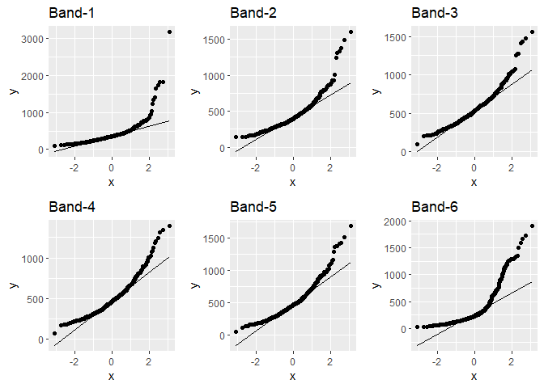<!-- -->

``` r
ggarrange(b7, b8, b8a, b9, b11, b12, nrow = 2, ncol = 3)
```

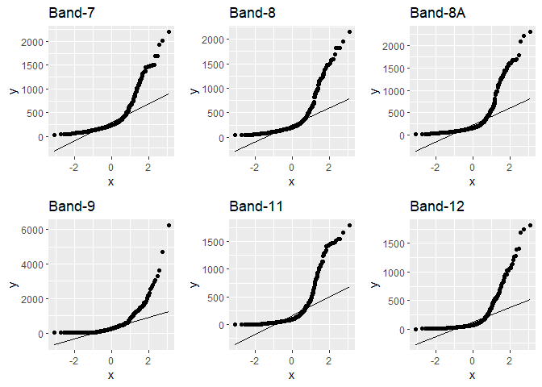<!-- -->

``` r
ggarrange(ndvi, cdom, ndci, nsmi, b43, b42, nrow = 2, ncol = 3)
```

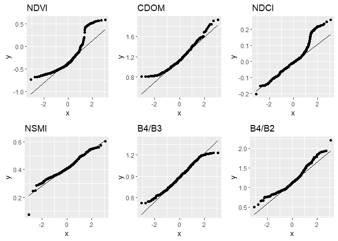<!-- -->

``` r
ggarrange(b41, salinity, nrow = 1, ncol = 2)
```

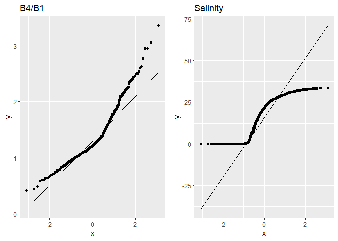<!-- -->

``` r
# b6, b7, b8, b8a, b9, b11, b12, ndvi, cdom, ndci, nsmi, b43, b42, b41,
```

We can observe that most of the variables are not normally distributed
(with exceptions such as NSMI). Moreover. our dependent variable, WSS,
has an interesting qq-plot. It is on either sides of the normal line,
which probably means that the variable is bimodal, likely having high
values near 0 and around 25-30. Let’s check that by plotting a histogram
for WSS.

``` r
ggplot(salinity_data, aes(x=GCE_Salinity)) + geom_histogram() + ggtitle("Salinity")
```

    ## `stat_bin()` using `bins = 30`. Pick better value with `binwidth`.

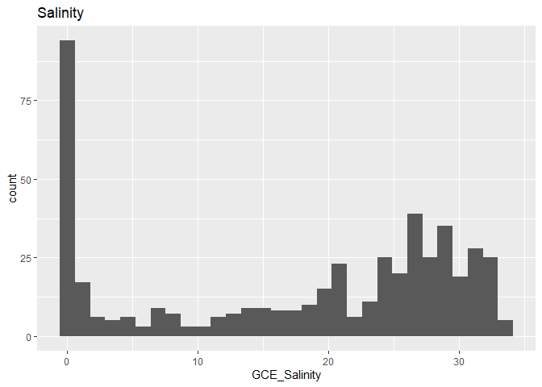<!-- -->

Clearly, WSS is a skewed variable. To make it a little less skewed, we
will filter out salinity values greater than 2. We will discard salinity
values from 0-2, as that is freshwater and we want to explore the
salinity dynamics along the coastal region while focusing on the
transition zone between freshwater and oceanic water.
[Reference](https://salinometry.com/pss-78/) Once filtered, we will once
again check the normality of all variables before we do further
analysis.

``` r
salinity_data_filtered <- salinity_data %>%
  filter(GCE_Salinity > 2)

ggplot(salinity_data_filtered, aes(x=GCE_Salinity)) + geom_histogram() + ggtitle("Salinity")
```

    ## `stat_bin()` using `bins = 30`. Pick better value with `binwidth`.

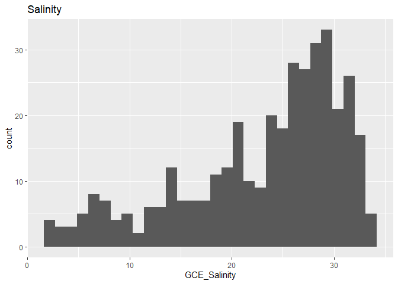<!-- -->

While still not normal, at least the WSS variable is tending towards a
unimodal distribution now. Let’s check if this changed the normality of
other variables.

``` r
b1 <- ggplot(salinity_data_filtered, aes(sample=ï..B1)) + stat_qq() + stat_qq_line() + ggtitle("Band-1")
b2 <- ggplot(salinity_data_filtered, aes(sample=B2)) + stat_qq() + stat_qq_line() + ggtitle("Band-2")
b3 <- ggplot(salinity_data_filtered, aes(sample=B3)) + stat_qq() + stat_qq_line() + ggtitle("Band-3")
b4 <- ggplot(salinity_data_filtered, aes(sample=B4)) + stat_qq() + stat_qq_line() + ggtitle("Band-4")
b5 <- ggplot(salinity_data_filtered, aes(sample=B5)) + stat_qq() + stat_qq_line() + ggtitle("Band-5")
b6 <- ggplot(salinity_data_filtered, aes(sample=B6)) + stat_qq() + stat_qq_line() + ggtitle("Band-6")
b7 <- ggplot(salinity_data_filtered, aes(sample=B7)) + stat_qq() + stat_qq_line() + ggtitle("Band-7")
b8 <- ggplot(salinity_data_filtered, aes(sample=B8)) + stat_qq() + stat_qq_line() + ggtitle("Band-8")
b8a <- ggplot(salinity_data_filtered, aes(sample=B8A)) + stat_qq() + stat_qq_line() + ggtitle("Band-8A")
b9 <- ggplot(salinity_data_filtered, aes(sample=B9)) + stat_qq() + stat_qq_line() + ggtitle("Band-9")
b11 <- ggplot(salinity_data_filtered, aes(sample=B11)) + stat_qq() + stat_qq_line() + ggtitle("Band-11")
b12 <- ggplot(salinity_data_filtered, aes(sample=B12)) + stat_qq() + stat_qq_line() + ggtitle("Band-12")
ndvi <- ggplot(salinity_data_filtered, aes(sample=NDVI)) + stat_qq() + stat_qq_line() + ggtitle("NDVI")
cdom <- ggplot(salinity_data_filtered, aes(sample=CDOM.Proxy..B3.B4.)) + stat_qq() + stat_qq_line() + ggtitle("CDOM")
ndci <- ggplot(salinity_data_filtered, aes(sample=NDCI)) + stat_qq() + stat_qq_line() + ggtitle("NDCI")
nsmi <- ggplot(salinity_data_filtered, aes(sample=NSMI)) + stat_qq() + stat_qq_line() + ggtitle("NSMI")
b43 <- ggplot(salinity_data_filtered, aes(sample=B4.B3)) + stat_qq() + stat_qq_line() + ggtitle("B4/B3")
b42 <- ggplot(salinity_data_filtered, aes(sample=B4.B2)) + stat_qq() + stat_qq_line() + ggtitle("B4/B2")
b41 <- ggplot(salinity_data_filtered, aes(sample=B4.B1)) + stat_qq() + stat_qq_line() + ggtitle("B4/B1")
salinity = ggplot(salinity_data_filtered, aes(sample=GCE_Salinity)) + stat_qq() + stat_qq_line() + ggtitle("Salinity")

ggarrange(b1, b2, b3, b4, b5, b6, nrow = 2, ncol = 3)
```

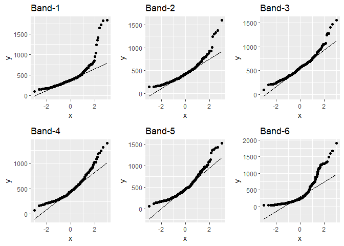<!-- -->

``` r
ggarrange(b7, b8, b8a, b9, b11, b12, nrow = 2, ncol = 3)
```

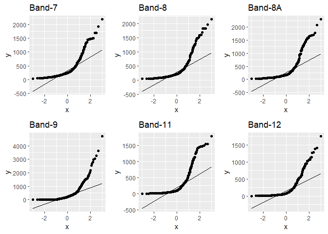<!-- -->

``` r
ggarrange(ndvi, cdom, ndci, nsmi, b43, b42, nrow = 2, ncol = 3)
```

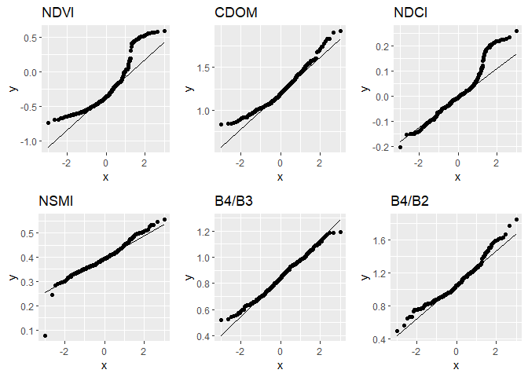<!-- -->

``` r
ggarrange(b41, salinity, nrow = 1, ncol = 2)
```

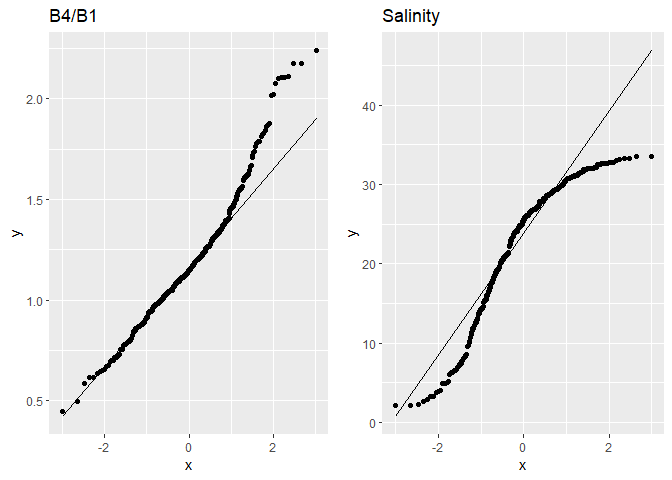<!-- -->

We can now see that the WSS qq-plot does not go on either sides of the
normal line. All short-wavelength bands are almost unchanged. However, I
feel that CDOM and band-ratios also normalized a little more than
earlier, which makes me wonder if they are highly correlated to WSS.
Let’s plot scatter plots of each variable against WSS to explore this.

``` r
b1 <- ggplot(salinity_data_filtered, aes(x=ï..B1, y=GCE_Salinity)) + geom_point() + ggtitle("Band-1")
b2 <- ggplot(salinity_data_filtered, aes(x=B2, y=GCE_Salinity)) + geom_point() + ggtitle("Band-2")
b3 <- ggplot(salinity_data_filtered, aes(x=B3, y=GCE_Salinity)) + geom_point() + ggtitle("Band-3")
b4 <- ggplot(salinity_data_filtered, aes(x=B4, y=GCE_Salinity)) + geom_point() + ggtitle("Band-4")
b5 <- ggplot(salinity_data_filtered, aes(x=B5, y=GCE_Salinity)) + geom_point() + ggtitle("Band-5")
b6 <- ggplot(salinity_data_filtered, aes(x=B6, y=GCE_Salinity)) + geom_point() + ggtitle("Band-6")
b7 <- ggplot(salinity_data_filtered, aes(x=B7, y=GCE_Salinity)) + geom_point() + ggtitle("Band-7")
b8 <- ggplot(salinity_data_filtered, aes(x=B8, y=GCE_Salinity)) + geom_point() + ggtitle("Band-8")
b8a <- ggplot(salinity_data_filtered, aes(x=B8A, y=GCE_Salinity)) + geom_point() + ggtitle("Band-8A")
b9 <- ggplot(salinity_data_filtered, aes(x=B9, y=GCE_Salinity)) + geom_point() + ggtitle("Band-9")
b11 <- ggplot(salinity_data_filtered, aes(x=B11, y=GCE_Salinity)) + geom_point() + ggtitle("Band-10")
b12 <- ggplot(salinity_data_filtered, aes(x=B12, y=GCE_Salinity)) + geom_point() + ggtitle("Band-11")
ndvi <- ggplot(salinity_data_filtered, aes(x=NDVI, y=GCE_Salinity)) + geom_point() + ggtitle("Band-12")
cdom <- ggplot(salinity_data_filtered, aes(x=CDOM.Proxy..B3.B4., y=GCE_Salinity)) + geom_point() + ggtitle("Band-CDOM")
ndci <- ggplot(salinity_data_filtered, aes(x=NDCI, y=GCE_Salinity)) + geom_point() + ggtitle("NDCI")
nsmi <- ggplot(salinity_data_filtered, aes(x=NSMI, y=GCE_Salinity)) + geom_point() + ggtitle("NSMI")
b43 <- ggplot(salinity_data_filtered, aes(x=B4.B3, y=GCE_Salinity)) + geom_point() + ggtitle("B4/B3")
b42 <- ggplot(salinity_data_filtered, aes(x=B4.B2, y=GCE_Salinity)) + geom_point() + ggtitle("B4/B2")
b41 <- ggplot(salinity_data_filtered, aes(x=B4.B1, y=GCE_Salinity)) + geom_point() + ggtitle("B4/B1")

ggarrange(b1, b2, b3, b4, nrow = 2, ncol = 2)
```

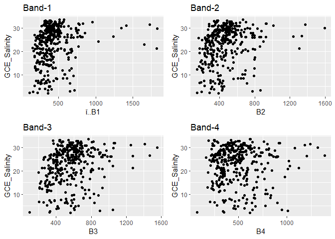<!-- -->

``` r
ggarrange(b5, b6, b7, b8, nrow = 2, ncol = 2)
```

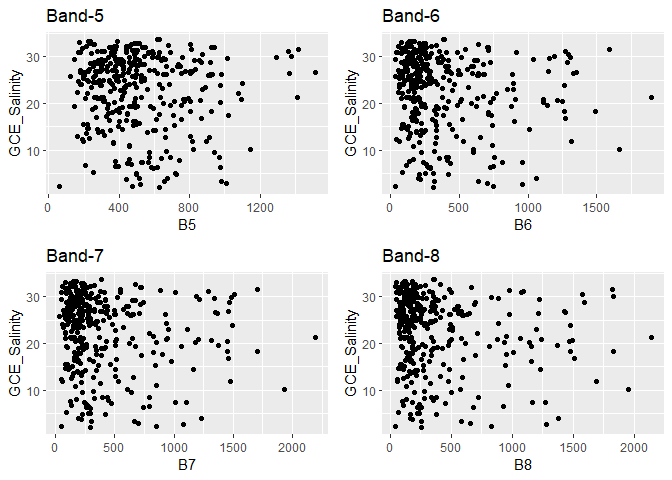<!-- -->

``` r
ggarrange(b8a, b9, b11, b12, nrow = 2, ncol = 2)
```

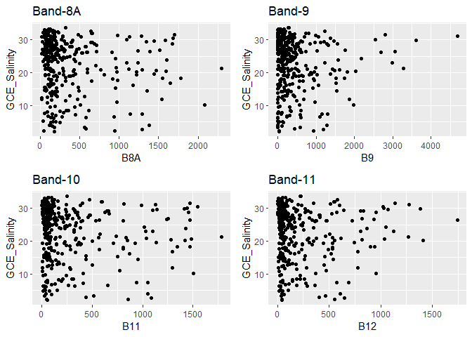<!-- -->

``` r
ggarrange(ndvi, cdom, ndci, nsmi, nrow = 2, ncol = 2)
```

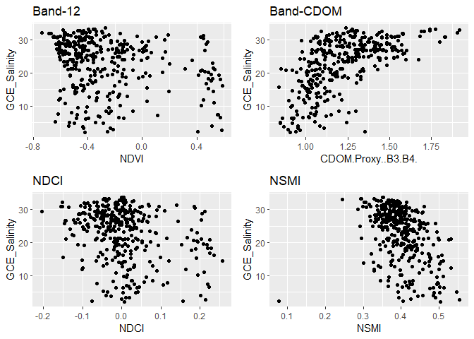<!-- -->

``` r
ggarrange(b43, b42, b41, nrow = 2, ncol = 2)
```

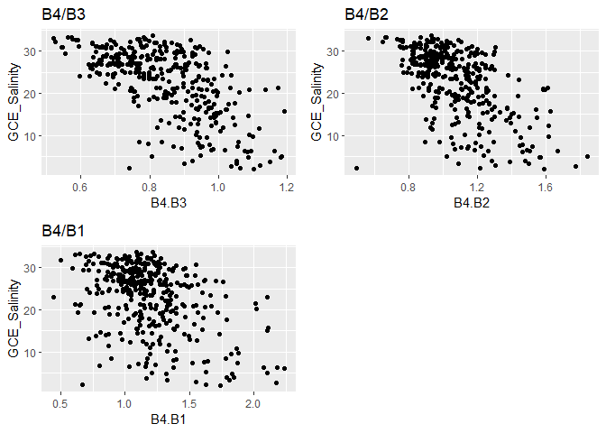<!-- -->

We can observe that Band-1 does show some positive correlation with WSS,
but as we start to go towards higher wavelength, the scatter plot starts
to spread out (bands 4,5) indicating decrease in correlation. Band 6
onwards it almost seems as if the scatter plot is almost all over the
place, indicating very less or no correlation, with the exception of
weak negative correlation for Band 12. On the other hand, the indices
and band ratios, as compared to the individual bands, definitely show a
pattern in the scatter plot indicating the presence of some correlation
with WSS (all ecept CDOM show negatively correlation), which infact
aligns well with my literature review.

> Section Summary: In this section we try to understand the nature of
> our data. We find out that WSS is bimodal, which makes it unsuitable
> to develop a model on right away, as those outliers will defintely
> create a bias. So we get rid of WSS values less than 2 psu and discard
> freshwater samples, with the motivation of looking into coastal
> ecosystem. We then analyze qq-plots which tell us that most of the
> variables are not normal and we further explore the relationship of
> all variables with WSS with the help of scatter plots.

### 1. What wavelength in the optical spectrum is sensitive to WSS variation?

To figure out what region of the optical spectrum is ideal to use for
estimating WSS, we will plot a correlation matrix of all bands and WSS
variable. Since we saw in the previous section that most of the data are
not normal, we will use Spearman Correlation.

``` r
# filtering out only bands
salinity_bands <- salinity_data_filtered %>% 
  select(-NDVI, -CDOM.Proxy..B3.B4., -NDCI, -NSMI, -B4.B3, -B4.B2, -B4.B1, -GCE_Temperature.C.)

# confirming all we have is bands and WSS
pander(head(salinity_bands))
```

| ï..B1 | B2  | B3  | B4  |  B5  |  B6  |  B7  |  B8  | B8A  |  B9  | B11  |
|:-----:|:---:|:---:|:---:|:----:|:----:|:----:|:----:|:----:|:----:|:----:|
|  156  | 191 | 327 | 339 | 523  | 959  | 1083 | 1284 | 1294 | 1183 | 1085 |
|  262  | 261 | 357 | 339 | 461  | 627  | 672  | 812  | 816  | 828  | 713  |
|  369  | 472 | 601 | 597 | 864  | 1212 | 1319 | 1492 | 1472 | 1487 | 1485 |
|  396  | 464 | 620 | 581 | 924  | 1494 | 1700 | 1828 | 1778 | 1734 | 1472 |
|  331  | 305 | 500 | 483 | 763  | 1111 | 1203 | 1243 | 1293 | 1610 | 1040 |
|  585  | 686 | 829 | 775 | 1147 | 1668 | 1934 | 1955 | 2084 | 1973 | 1507 |

Table continues below

| B12  | GCE_Salinity |
|:----:|:------------:|
| 647  |     2.62     |
| 444  |    19.26     |
| 1035 |    20.58     |
| 941  |    18.31     |
| 612  |    20.87     |
| 954  |    10.13     |

``` r
# now we will plot a correaltion matrix
CM <- cor(salinity_bands, method = "spearman")
corrplot(CM, method = "color", addCoef.col = "grey", number.cex = 0.7)
```

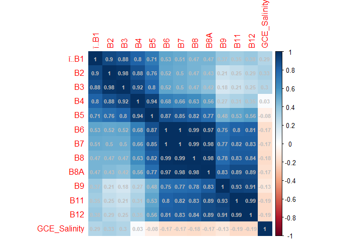<!-- -->

To see which bands are sensitive to WSS variation, we simply need to
look at the last row (GCE_Salinity). To look at this in another
interesting way, we can plot a line chart of only the last row and look
for evident peaks or bumps - this would show high correlation in either
direction and we can conclude that those bands, if not completely, are
more sensitive to WSS variation from among all 12 bands. We will plot
this line chart in the next step.

Before that, there is also a lot of other information in this
correlation plot:

-   WSS variation is positively correlated with shortwavelength
    bands,but it starts to form an inverse relationship as we go towards
    high wavelength bands.
-   Bands 2,3 are highly correlated
-   Bands 4,5 are highly correlated
-   Bands 6,7,8,8A are highly correlated
-   Bands 11,12 are highly correlated

We can use this information when we build a model to predict salinity
using bands as covariables. For instance, from a group of highly
correlated bands, we should choose only one of them as a covariable,
maybe the one which has highlest correlation with WSS. This will make
sure that the model does not get confused because each covariable will
then carry uniue information.

``` r
corr_data <- data.frame(as.data.frame(CM)$GCE_Salinity)
corr_data$Bands <- c('B1','B2','B3','B4','B5','B6','B7','B8','B8A','B9','B11','B12', 'WSS')
colnames(corr_data) <- c('Correlation', 'Bands')

# reomving last row (we don't need WSS)
corr_data <- head(corr_data, -1)

# adding a dummy column to reorder data -- this is to avoid the automatic sorting of x-axis by ggplot
corr_data$order <- c(1: length(corr_data$Bands))

ggplot(data = corr_data, aes(x=reorder(Bands, order), y = Correlation, yend=0, group = 1)) +
  xlab("Bands") +
  geom_line(color = "red") + 
  geom_point() +
  geom_hline(yintercept = 0)
```

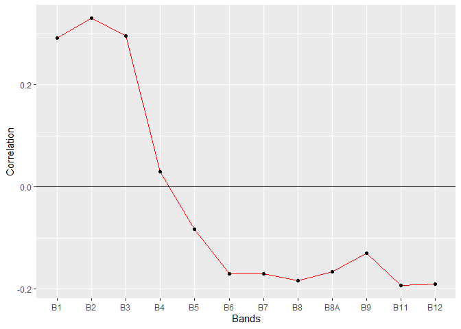<!-- -->

Based on the graph above, which shows the variation of correlation with
WSS among all bands, I would select the bands farthest from 0 in either
directions as the ones sensitive to WSS variation. Following that
criteria, we can select Bands 1, 2, 3, 11 and 12 as the bands that are
sensitive to salinity. Let’s see if we can use them as covariables and
try to predict salinity using linear regression.

``` r
model1 <- lm(GCE_Salinity ~ ï..B1 + B2 + B3 + B11 + B12, data=salinity_data_filtered)
summary(model1)
```

    ## 
    ## Call:
    ## lm(formula = GCE_Salinity ~ ï..B1 + B2 + B3 + B11 + B12, data = salinity_data_filtered)
    ## 
    ## Residuals:
    ##     Min      1Q  Median      3Q     Max 
    ## -23.713  -4.285   1.897   5.412  12.523 
    ## 
    ## Coefficients:
    ##              Estimate Std. Error t value Pr(>|t|)    
    ## (Intercept) 17.605168   1.422848  12.373   <2e-16 ***
    ## ï..B1        0.004201   0.003969   1.058    0.291    
    ## B2           0.004073   0.009791   0.416    0.678    
    ## B3           0.005394   0.008667   0.622    0.534    
    ## B11         -0.002285   0.004540  -0.503    0.615    
    ## B12         -0.003347   0.006612  -0.506    0.613    
    ## ---
    ## Signif. codes:  0 '***' 0.001 '**' 0.01 '*' 0.05 '.' 0.1 ' ' 1
    ## 
    ## Residual standard error: 7.578 on 367 degrees of freedom
    ## Multiple R-squared:  0.09602,    Adjusted R-squared:  0.08371 
    ## F-statistic: 7.797 on 5 and 367 DF,  p-value: 5.465e-07

Clearly the model is not a good fit. None of the variables are
significant and the model R-sq is only 9.6%, meaning the chosen
covariables only explain less than 10% of the variation in WSS.
Individually, the covariables are explaining WSS by a very small
magnitude (so we won’t discuss inference of each coviariable separately
for this model). We saw in the previous section that Bands 2 and 3 are
highly correlated. Let’s exclude Band 3 as a covariable and see if that
model does any better.

``` r
model2 <- lm(GCE_Salinity ~ ï..B1 + B2 + B11 + B12, data=salinity_data_filtered)
summary(model2)
```

    ## 
    ## Call:
    ## lm(formula = GCE_Salinity ~ ï..B1 + B2 + B11 + B12, data = salinity_data_filtered)
    ## 
    ## Residuals:
    ##     Min      1Q  Median      3Q     Max 
    ## -23.434  -4.461   2.071   5.484  12.685 
    ## 
    ## Coefficients:
    ##              Estimate Std. Error t value Pr(>|t|)    
    ## (Intercept) 18.139826   1.133298  16.006   <2e-16 ***
    ## ï..B1        0.004177   0.003966   1.053   0.2929    
    ## B2           0.009694   0.003777   2.566   0.0107 *  
    ## B11         -0.002477   0.004526  -0.547   0.5845    
    ## B12         -0.003169   0.006600  -0.480   0.6314    
    ## ---
    ## Signif. codes:  0 '***' 0.001 '**' 0.01 '*' 0.05 '.' 0.1 ' ' 1
    ## 
    ## Residual standard error: 7.571 on 368 degrees of freedom
    ## Multiple R-squared:  0.09507,    Adjusted R-squared:  0.08523 
    ## F-statistic: 9.665 on 4 and 368 DF,  p-value: 1.925e-07

There is no significant change in the model performance except B2
becoming a significant covariable.

> Section Summary: We found out what bands are most sensitive to
> salinity variation. Then we tried to use those bands to model
> salinity, but the models were not a good fit. This indicates that we
> might need more covariables except the bands to model WSS.

### 2. Can we use literary proven remote sensing indices to model WSS?

Literature links WSS variation with changes in CDOM, phytoplankton
blooms (NDCI), turbidity (NSMI) and three band ratios (B4/B3, B4/B2,
B4/B1). Let’s see if we can use them as covariables to estimate WSS.
Before that, let’s plot a correlation matrix for these variables to
check for any high correlation among the independent variables.

``` r
# filtering data points only to indices
salinity_indices <- salinity_data_filtered %>%
  select(CDOM.Proxy..B3.B4., NDCI, NSMI, B4.B3, B4.B2, B4.B1, GCE_Salinity)

# making sure all we have is indices and salinity
pander(head(salinity_indices))
```

| CDOM.Proxy..B3.B4. |  NDCI  |  NSMI  | B4.B3  | B4.B2 | B4.B1 | GCE_Salinity |
|:------------------:|:------:|:------:|:------:|:-----:|:-----:|:------------:|
|       0.9646       | 0.2135 | 0.5543 | 1.037  | 1.775 | 2.173 |     2.62     |
|       1.053        | 0.1525 | 0.4545 | 0.9496 | 1.299 | 1.294 |    19.26     |
|       1.007        | 0.1828 | 0.4347 | 0.9933 | 1.265 | 1.618 |    20.58     |
|       1.067        | 0.2279 | 0.4426 | 0.9371 | 1.252 | 1.467 |    18.31     |
|       1.035        | 0.2247 | 0.5264 | 0.966  | 1.584 | 1.459 |    20.87     |
|        1.07        | 0.1935 | 0.4009 | 0.9349 | 1.13  | 1.325 |    10.13     |

``` r
# we know that all of these variables are not normal so again we will use spearman correlation 
CM <- cor(salinity_indices, method = "spearman")
corrplot(CM, method = "color", addCoef.col = "grey")
```

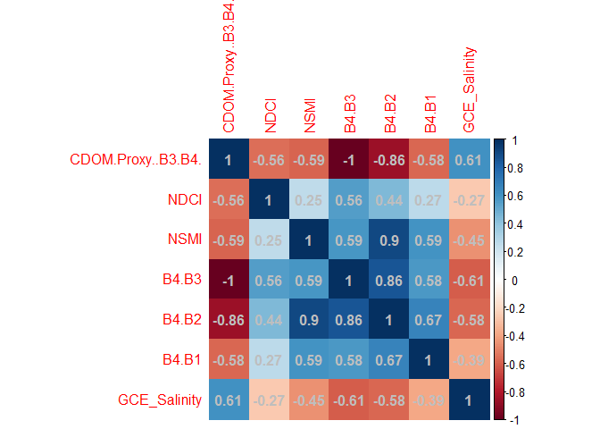<!-- -->

Even though a few covariables are explaining each other well, we will
not discard any of them owing to the literature. Also, it appears that
CDOM is simply inverse of B4/B3, so we can get rid of CDOM as a
covariable. Let’s see if we can estimate salinity using this set of
covariables and a linear model.

``` r
# removing cdom
salinity_indices <- salinity_indices %>%
  select(-CDOM.Proxy..B3.B4.)

# model
model3 <- lm(GCE_Salinity ~ NDCI + NSMI + B4.B3 + B4.B2 + B4.B1, data = salinity_indices)
summary(model3)
```

    ## 
    ## Call:
    ## lm(formula = GCE_Salinity ~ NDCI + NSMI + B4.B3 + B4.B2 + B4.B1, 
    ##     data = salinity_indices)
    ## 
    ## Residuals:
    ##      Min       1Q   Median       3Q      Max 
    ## -19.9493  -3.6526   0.4927   3.7829  13.2056 
    ## 
    ## Coefficients:
    ##             Estimate Std. Error t value Pr(>|t|)    
    ## (Intercept)   28.536      6.369   4.481 9.96e-06 ***
    ## NDCI           5.690      4.244   1.341    0.181    
    ## NSMI         121.897     27.620   4.413 1.34e-05 ***
    ## B4.B3          3.358      8.079   0.416    0.678    
    ## B4.B2        -51.738     10.465  -4.944 1.17e-06 ***
    ## B4.B1         -1.170      1.380  -0.848    0.397    
    ## ---
    ## Signif. codes:  0 '***' 0.001 '**' 0.01 '*' 0.05 '.' 0.1 ' ' 1
    ## 
    ## Residual standard error: 5.959 on 367 degrees of freedom
    ## Multiple R-squared:  0.441,  Adjusted R-squared:  0.4334 
    ## F-statistic: 57.91 on 5 and 367 DF,  p-value: < 2.2e-16

This model certainly did way better than the band-based models. We can
observe that not only is the model significant, but the R-sq shoots up
to 44%, which is pretty decent. Two of the chosen covariables are
significant - NSMI and B4/B2. Discussing about how the covariables are
explaining the variation in WSS:

-   for every 1 unit increase in NDCI, WSS increases by 6 units, which
    is interesting to me as literature points out that dying
    phytoplankton affects WSS.
-   for every 1 unit increase in NSMI, WSS increases by 122 units, which
    in fact makes sense despite 122 being a big jump in salinity units.
    This is because NSMI is an index that ranges from 0-1, 1 being the
    most turbid. In real life, we wouldn’t see an NSMI value change from
    0 to 1 within a very small spatial area – it *might* happen when we
    come from a central part of ocean to the marshy coast
-   for every 1 unit increase in B4/B3, WSS increases by 3 units
-   for every 1 unit increase in B4/B2, WSS decreases by 52 units. This
    is interesting to me and makes me wonder if the band ratio B4/B2 is
    a better proxy for CDOM instead of B4/B3, because there is
    consistent literature pointing out and using inverse relationship
    between WSS and salinity
-   for every 1 unit increase in B4/B1, WSS decreases by 1 unit. Using
    B1 is always tricky business as it containes the highest scattering
    signal from the atmosphere

Let’s look at the model residuals and check the model for
multicollinearity and heteroskedasticity

``` r
# normality of residuals
ggplot(model3, aes(sample=model3$residuals)) + stat_qq() + stat_qq_line() + ggtitle("WSS~Indices Residuals")
```

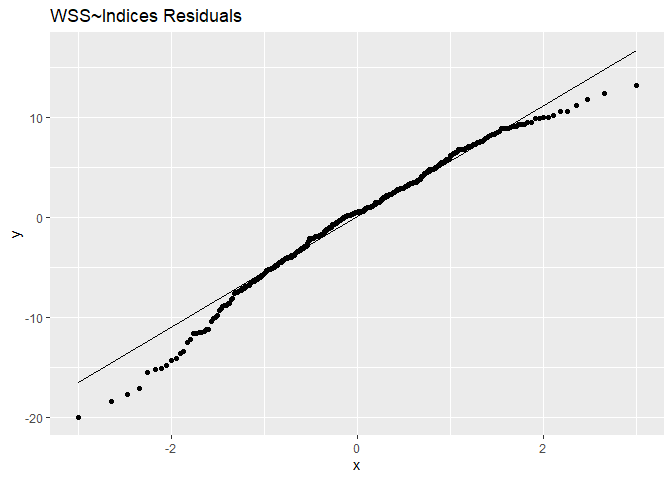<!-- -->

``` r
# multicollinearity 
vif(model3)
```

    ##      NDCI      NSMI     B4.B3     B4.B2     B4.B1 
    ##  1.337208 22.420254 12.665575 51.252346  1.841658

``` r
#heteroskedasticity 
bptest(model3)
```

    ## 
    ##  studentized Breusch-Pagan test
    ## 
    ## data:  model3
    ## BP = 32.378, df = 5, p-value = 5e-06

As we can see here:

-   The model residuals are not normal (although they are for the most
    part, they converge into a frown) and are negatively skewed, which
    indicates that the outliers are creating some bias in the model.
-   There is definitely multicollinearity in the data, since the vif
    factor is not between 0-2 for all covariables.
-   Moreover, the bp-test also indicates that the data is
    heteroskedastic, since p-value is significant and our hypothesis
    that the data is not heteroskedastic is rejected.

So this is evidently not the best model for estimating WSS from
satellite data, but seemingly not the worst either. And it does answer
our question – it is definitely possible to estimate WSS using the
literary proven indices and band ratios. Let’s see if we can make a
better model by including the bands that we identified in the previous
section.

``` r
# filtering selected covariables
salinity_final <- salinity_data_filtered %>%
  select(ï..B1, B2, B3, B11, B12, NDCI, NSMI, B4.B3, B4.B2, B4.B1, GCE_Salinity)

# verifying
pander(head(salinity_final))
```

| ï..B1 | B2  | B3  | B11  | B12  |  NDCI  |  NSMI  | B4.B3  | B4.B2 | B4.B1 |
|:-----:|:---:|:---:|:----:|:----:|:------:|:------:|:------:|:-----:|:-----:|
|  156  | 191 | 327 | 1085 | 647  | 0.2135 | 0.5543 | 1.037  | 1.775 | 2.173 |
|  262  | 261 | 357 | 713  | 444  | 0.1525 | 0.4545 | 0.9496 | 1.299 | 1.294 |
|  369  | 472 | 601 | 1485 | 1035 | 0.1828 | 0.4347 | 0.9933 | 1.265 | 1.618 |
|  396  | 464 | 620 | 1472 | 941  | 0.2279 | 0.4426 | 0.9371 | 1.252 | 1.467 |
|  331  | 305 | 500 | 1040 | 612  | 0.2247 | 0.5264 | 0.966  | 1.584 | 1.459 |
|  585  | 686 | 829 | 1507 | 954  | 0.1935 | 0.4009 | 0.9349 | 1.13  | 1.325 |

Table continues below

| GCE_Salinity |
|:------------:|
|     2.62     |
|    19.26     |
|    20.58     |
|    18.31     |
|    20.87     |
|    10.13     |

``` r
# model
model4 <- lm(GCE_Salinity ~ ï..B1 + B2 + B3 + B11 + B12 + NDCI + NSMI + B4.B3 + B4.B2 + B4.B1, data = salinity_final)
summary(model4)
```

    ## 
    ## Call:
    ## lm(formula = GCE_Salinity ~ ï..B1 + B2 + B3 + B11 + B12 + NDCI + 
    ##     NSMI + B4.B3 + B4.B2 + B4.B1, data = salinity_final)
    ## 
    ## Residuals:
    ##      Min       1Q   Median       3Q      Max 
    ## -23.3676  -2.9284   0.4181   3.3312  16.2488 
    ## 
    ## Coefficients:
    ##               Estimate Std. Error t value Pr(>|t|)    
    ## (Intercept)  3.015e+01  6.160e+00   4.894 1.49e-06 ***
    ## ï..B1       -5.502e-04  4.295e-03  -0.128 0.898128    
    ## B2          -1.623e-02  1.405e-02  -1.155 0.248807    
    ## B3           2.459e-02  1.208e-02   2.035 0.042594 *  
    ## B11         -3.156e-04  4.218e-03  -0.075 0.940401    
    ## B12          2.774e-03  5.270e-03   0.526 0.598904    
    ## NDCI        -1.898e+00  6.944e+00  -0.273 0.784778    
    ## NSMI         8.833e+01  2.734e+01   3.231 0.001346 ** 
    ## B4.B3       -8.129e+00  8.697e+00  -0.935 0.350619    
    ## B4.B2       -3.700e+01  1.018e+01  -3.636 0.000317 ***
    ## B4.B1       -2.234e+00  2.046e+00  -1.092 0.275711    
    ## ---
    ## Signif. codes:  0 '***' 0.001 '**' 0.01 '*' 0.05 '.' 0.1 ' ' 1
    ## 
    ## Residual standard error: 5.549 on 362 degrees of freedom
    ## Multiple R-squared:  0.5219, Adjusted R-squared:  0.5087 
    ## F-statistic: 39.52 on 10 and 362 DF,  p-value: < 2.2e-16

This is definitely an improvement from the previous model that we had,
as now the covariables explain more than 50% of the variation in
salinity, which is not too bad an R-sq (0.52). However, only one of the
covariables, B4.B2 is significant this time. Bands are not explaining
the variation with a higher magnitude, however, by including all the
bands as covariables, I feel that the indices are explaining the WSS
variation way more realisitically (I will only point out specific
covariables):

-   For every 1 unit increase in NDCI, WSS decreases by \~2 units. This
    makes more sense to me now, as dying phytoplankton is supposed to
    affect WSS and here, as NDCI increases, phytoplankton is increasing
    and not dying off, so less turbidity and hence decreased salinity
-   For every 1 unit in NSMI, WSS increases by 9 units. Again, a way
    more realistic increase in salinity due to turbidity as compared to
    the previous model

Let’s run some model diagnostics:

``` r
# normality of residuals
ggplot(model4, aes(sample=model4$residuals)) + stat_qq() + stat_qq_line() + ggtitle("WSS~Indices + Bands: Residuals")
```

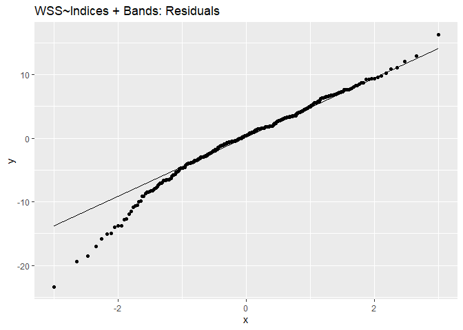<!-- -->

``` r
# multicollinearity
vif(model4)
```

    ##     ï..B1        B2        B3       B11       B12      NDCI      NSMI     B4.B3 
    ## 10.887819 93.475389 77.772558 31.501841 28.453005  4.129095 25.331808 16.929753 
    ##     B4.B2     B4.B1 
    ## 55.878007  4.667690

``` r
# heteroskedasticity
bptest(model4)
```

    ## 
    ##  studentized Breusch-Pagan test
    ## 
    ## data:  model4
    ## BP = 26.194, df = 10, p-value = 0.003487

So evidently, there are still issues with the model:

-   Residuals are not entirely normal
-   Definite multicollinearity and hetereoskedasticity issues in the
    data

While this model could still use some fine-tuning, it can serve as a
base to build up more on how we can estimate WSS entirely from remote
sensing data.

> Section Summary: We tried to use indices to predict salinity and found
> that they do a way better job than bands, following which we tried to
> model salinity using both bands and indices which definitely improved
> the model.

## Discussion

Most of the inferences are linked in the previous section, so this
section focuses on answering the research questions of the project.

1.  *Is it possible to estimate water surface salinity by remote sensing
    methods using satellite data, specifically along the coast of
    Georgia? If yes, what wavelength is sensitive to WSS variation?*

Yes, it is definitely possible to estimate WSS by using entirely remote
sensing data. To account for the fact that the salinity estimation is
tuned for coastal regions, the salinity data was filtered for salinity
values only greater than 2, getting rid of all freshwater. While WSS
does not have any evident Statistical analysis indicated that among all
the Sentinel-2 bands, Band-2 is the most sensitive to salinity
variation. Band-2 is at 494 nm, so we can say that far blue region of
the optical spectrum is most sensitive to salinity variation.

2.  *Moreover, since WSS depends highly on the turbidity and suspended
    particles in the water, can remote sensing based indices/quantities
    such as Color Dissolved Organic Matter (CDOM), Normalized Difference
    Chlorophyll Index (NDCI) and Normalized Suspended Material Index
    (NSMI) be used as proxy to estimate WSS from satellite data?*

Yes, the remote sensing based indices actually do a pretty decent job at
predicting WSS. Statistical analysis indicated that a linear model
comprising only of the indices as covariables explained upto 44% of the
WSS variation. Moreover, it was discovered that the ‘CDOM’ variable was
an inverse of the band ratio B4/B3. Since CDOM is known to have an
inverse relationship with WSS, B4/B3 might have been an incorrect proxy
for it and B4/B2 instead may be a better proxy.

The modelling for this project was carried out in steps and model
diagnostics run for all models. It was discovered that by using a
combination of both bands and indices as covariables to linear model
WSS, more than 50% of WSS variation is being explained. This model,
while still having issues of multicollinearity and heteroskedasticity,
can definitely serve as a starting point when it comes to predicting WSS
from satellite-based reflectance data. All in all, this study in itself
exolores the whole idea of estimating WSS from satellite data with some
initial statistical analysis and concludes that even though WSS does not
have an evident color signal, it is indeed possible to predict WSS from
space!

## Self-reflection

I really had a lot of fun doing this project mainly because a) I was
able to make sure that I implement everything that I was hoping to learn
out of this course in this project, giving me a guage of how far I was
able to come b) This is also a research that I am working on and it was
really exciting to see the initial results. This project spans across
almost all the labs (maybe except the mapping ones) and coveres reading
data, filtering data, data pre-analysis and assessing the normality
(more importantly why), modelling univariate and multivariate
regressions, understanding and inferring the models and also running
model diagnostics to explore underlying issues because a high r-sq
doesn’t always mean a really good mode. I remember I asked you one
question – why use both qq-plots and histograms, and I think this
project perfectly answered that question for me (Section 0 of Analysis).
Moreover, I had a challenging time in Lab-7 in model inference and
heteroskedasticity, so I made sure to have them as a requirement for
this project – it helped me understand them better and infer models
correctly. Overall, I think I did a pretty good job on the project, and
I think I’m a lot less intimidated now when it comes to statistics.
THANK YOU SO MUCH for such a wonderful semester, Dr. Shannon!
